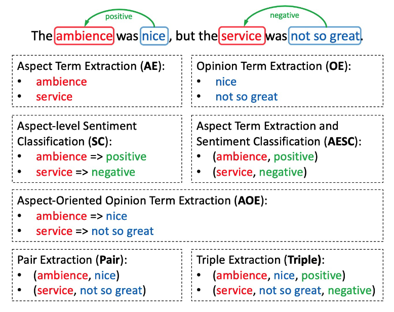

细粒度情感分析
===
> Aspect Based Sentiment Analysis, ABSA
- Aspect 直译为“方面”，具体可以理解为意见指向的“目标（Target）”或“情感对象”；一些场景下可以理解为“属性”、“维度”、“功能”等；

**相关子任务示例**$^{[1]}$

> 其中 "ambience/service" 为 Aspect Terms（AT），"nice/not so great" 为 Opinion Terms（OT）

- AE: 情感对象抽取、属性识别
- OE: 意见/评价抽取
- SC: 情感分类（极性分类）
- AESC: 抽取目标并进行情感分类
- AOE: 面向目标抽取意见/评价
- Pair: 同时抽取（Aspect, Opinion）
- Triple: 同时抽取（Aspect, Opinion, Sentiment）

## 参考文献
$[1]$ 【2021】[A Joint Training Dual-MRC Framework for Aspect Based Sentiment Analysis](https://arxiv.org/abs/2101.00816)  
$[2]$ 【2019】[细粒度情感分析（ABSA），一个从零开始的案例教程【Python实现】_HapHapYear的博客 - CSDN博客](https://blog.csdn.net/HapHapYear/article/details/101102870)  