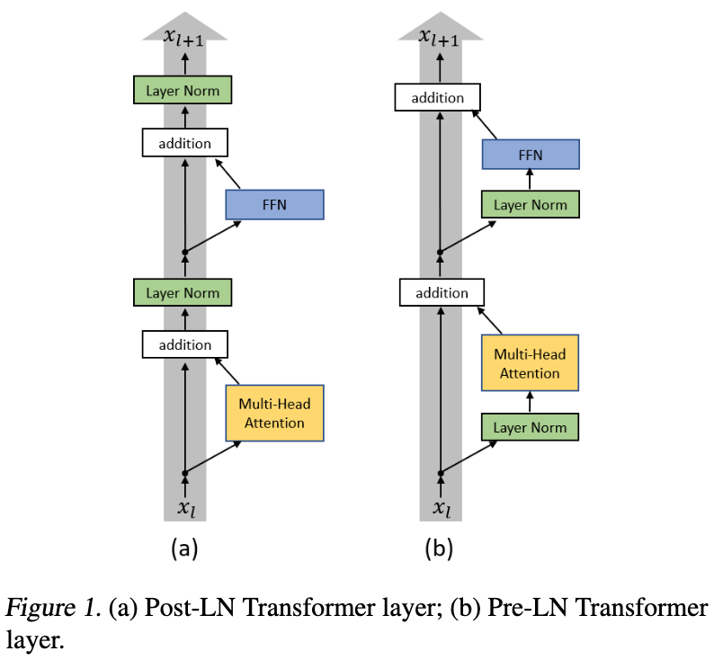

Transformer 模型族
===

Index
---
<!-- TOC -->

- [Transformer](#transformer)
    - [Transformer 改进](#transformer-改进)
- [BERT 相关](#bert-相关)
    - [SentenceBERT](#sentencebert)

<!-- /TOC -->

## Transformer
- 【2017】[Attention Is All You Need](https://arxiv.org/abs/1706.03762)
    > 提出 Transformer 结构

### Transformer 改进
- 【2020】[On Layer Normalization in the Transformer Architecture](https://arxiv.org/abs/2002.04745)
    > 分析了 PerLN 和 PostLN 的优缺点：
    > - PreLN 对梯度下降更友好，收敛更快，对超参数更鲁棒，但性能一般弱于 PostLN；
    > - PostLN 更难训练，需要从一个较小的学习率开始，配合预热（warm-up）进行训练；

- 【2020】[RealFormer: Transformer Likes Residual Attention](https://arxiv.org/abs/2012.11747)
    > 兼顾 PostLN 的性能和 PreLN 的稳定
    - 【解读】[RealFormer：把残差转移到Attention矩阵上面去 - 科学空间](https://kexue.fm/archives/8027)
- 【2020】[ReZero is All You Need: Fast Convergence at Large Depth](https://arxiv.org/abs/2003.04887)
    > 针对残差结构的优化：$x+f(x)$ → $x+αf(x)$，主要用于加速收敛，论文表明可以代替 Transformer 中的 LayerNorm 层
    - 【Github】[Official PyTorch Repo for "ReZero is All You Need: Fast Convergence at Large Depth"](https://github.com/majumderb/rezero)
- 实现
    - 【pytorch】[The Annotated Transformer](http://nlp.seas.harvard.edu/2018/04/03/attention.html)
        > 这里使用的是 PerLN，官方实现为 PostLN

## BERT 相关

### SentenceBERT
> 【2019】[Sentence-BERT: Sentence Embeddings using Siamese BERT-Networks](https://arxiv.org/abs/1908.10084)
>> 句向量、孪生网络；语义相似度计算、聚类

